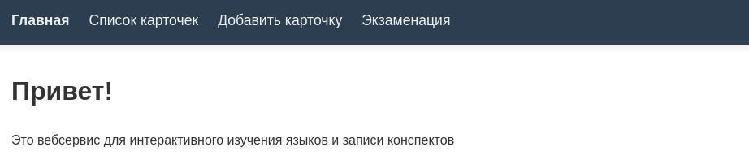
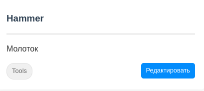
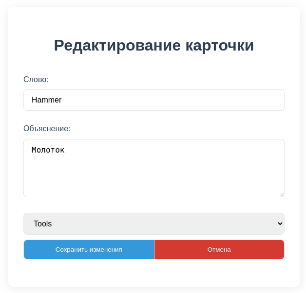
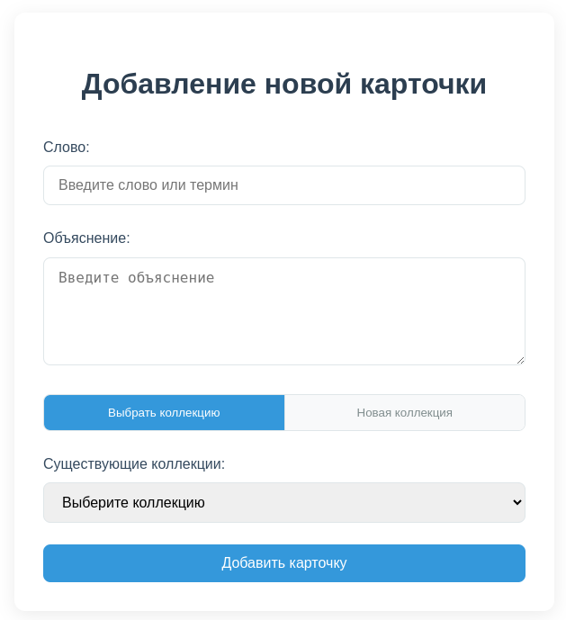
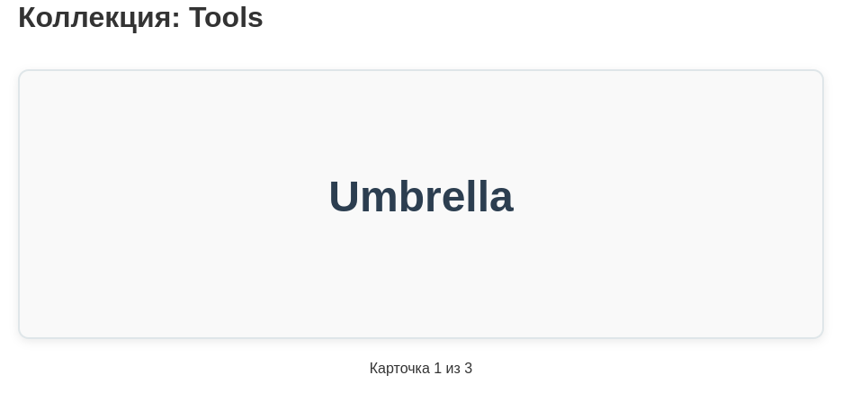
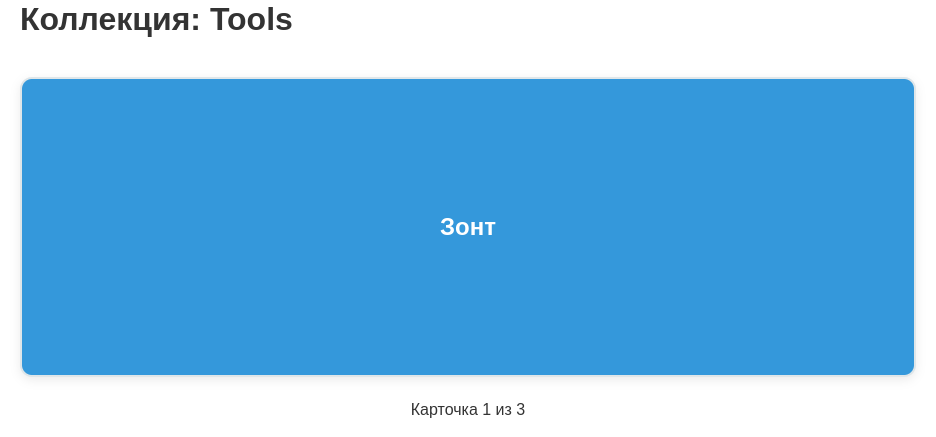

# Language flashcards

Web application written in python using Django for creating and managing language flashcards.

## Getting Started

### 1. Clone the repository
```bash
git clone git@github.com:bwyltcaxe/python_language_flashcards.git
cd python_language_flashcards
```

### 2. Install project dependencies
```bash
pip install -r requirements.txt
```

### 3. Apply db migrations
```bash
python manage.py migrate
```

### 4. Run service
```bash
python manage.py runserver
```

## For Users



Currently, as you may see on the screen 'Главная', 'Список карточек', 'Добавить карточку', 'Экзаменация' tabs are available.

* **Главная** -- the greetings page
* **Список карточек** -- the list of cards with respect to filtration. If you'd like to edit an already existing card, you should follow this tab:



Here is an 'Редактировать' button will redirect you to an edit page:



* **Добавить карточку** -- the form to add a new card to an already existing collection **or** create a new collection.


 
* **Экзаменация** -- simple card-going where the answer is hidden. To show it you should click on card. The second-click will direct you to the next card.

Before click:



After click:



## For Developers

Some useful information for developers.

### Run pylint

```bash
pylint --load-plugins pylint_django language_flashcards/
```

If you don't have pylint_django installed yet, you should do the following:
```bash
pip install pylint-django
```

Otherwise, you'll get spurious errors:
```bash
Class 'Collection' has no 'objects' member (no-member)
```
